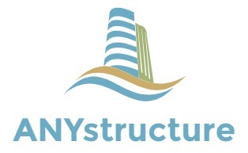

Welcome to ANYstructure's documentation!
========================================
This documentation focuses on the Python API and the current public
functionality exposed by the ``anystruct`` package.

For GUI documentation, see the following link:

`ANYstructure GUI documentation <https://sites.google.com/view/anystructure/start>`_

Python
------
To install ANYstructure use PIP:

.. code:: shell

   pip install anystructure

API basic usage:

.. code:: python

   from anystruct import api
   flat = api.FlatStru("Flat plate, stiffened")
   cylinder = api.CylStru("Orthogonally Stiffened shell")

See :doc:`api_examples` for complete flat plate, cylinder, buckling method,
and project file examples. See :doc:`api_manual_report` for a compact
manual/report version.

The GUI can be started by:

.. code:: shell

   from anystruct import gui
   gui.main()

An entry point to the GUI is also installed with PIP:

ANYstructure.exe in your python installation (Scripts).

Finite-element GUI
------------------

The finite-element workflow uses ``ANYsolver>=0.4.1,<0.5`` and the extracted
``ANYmaterial>=0.2.0,<0.3``, ``ANYmesher>=0.4.0,<0.5``, and
``ANYfileio[semantics]>=0.3.1,<0.4`` packages. Its load controls
route axial force, bending moment, shear force, torsional moment, and pressure
to the production solver. Follower pressure is enabled only for supported
nonlinear static and arc-length analyses using the Static only or Nonlinear
static runtime path. Unsupported configurations and solver failures are
reported directly rather than replaced by an estimate.

Model, mesh, and result viewports use the shared ANY3dView contract and can be
switched live between ModernGL GPU and ANYtk3D software rendering.

Raised horizontal dividers resize the input, model, and result sections. A
raised vertical divider between result text and the result canvas makes the
canvas height adjustable.

Windows executable
------------------
The latest release of ANYstructure can be downloaded here:

`Github releases <https://github.com/audunarn/ANYstructure/releases>`_

Install and launch the app.

.. toctree::
    :hidden:

   install
   support
   api_examples
   api_manual_report
   api
   modules
